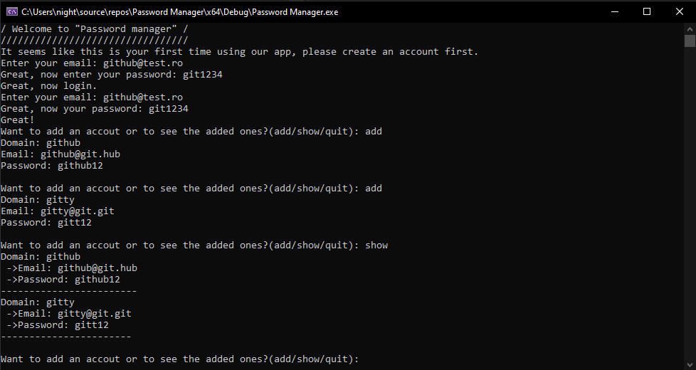

# C-Plus-Plus-Password-Manager
Simple password manager(local); Version C++

This applications checks if the user has an account created before using it, if he doesnt, he creates one, then he must login using that account. After he logins, he can either add a list with the following format (Domain ; Email ; Password) or he can either see the existent ones


>


>
```
#include <iostream>
#include <fstream>
#include <string>
using std::ifstream;
using std::ofstream;
using std::cout;
using std::endl;
using std::string;
using std::getline;
using std::cin;

int contains_char(string x, char y); // Functie ce verifica daca un string contine un caracter
int contains_string(string x, string y); // [...] contine un alt string in primul
string _lowercase(string x); // Transforma string-ul intr-unul cu majusculele transformate in litere mici
void start(); // Start program
void startCheck(); // Verifica daca este utilizator nou sau nu
void registerAcc(); // Creeaza cont pentru aplicatie
void loginAcc(); // Intra in aplicatie folosindu-se de cont
void mainApp(); // (Adaugare/Vedere conturi)/Iesire aplicatie     

int main() {
	start();
}

int contains_char(string x, char y) {
	for (size_t i = 0; i < x.length(); i++) {
		if (x[i] == y) {
			return 1;
		}
	}
	return 0;
}
int contains_string(string x, string y) {
	size_t pos = 0;
	for (size_t i = 0; i < x.length(); i++) {
		while (x[i] == y[pos]) {
			i++;
			pos++;
			if (pos == y.length() - 1) {
				return 1;
			}
		}
	}
	return 0;
}
string _lowercase(string x) {
	for (size_t i = 0; i < x.length(); i++) {
		if ((int)x[i] >= 65 && (int)x[i] <= 89) {
			x[i] = (int)x[i] + 32;
		}
	}
	return x;
}

void start() {
	cout << "/////////////////////////////////\n";
	cout << "/ Welcome to \"Password manager\" /\n";
	cout << "/////////////////////////////////\n";
	startCheck();
}

void startCheck() {
	string line;
	char response = 'n';
	ifstream checkR("info.txt");
	while (getline(checkR, line)) {
		if (line != "") {
			response = 'y';
			checkR.close();
			loginAcc();
		}
	}
	if (response == 'n') {
		cout << "It seems like this is your first time using our app, please create an account first.\n";
		checkR.close();
		registerAcc();
	}
}

void registerAcc() {
	string email, password;
	cout << "Enter your email: "; cin >> email;
	if (!(contains_char(email, '@') && contains_char(email, '.') && email.length() > 5)) {
		cout << "Email is invalid.....\n";
		registerAcc();
	}
	cout << "Great, now enter your password: "; cin >> password;
	ofstream appCredentials("info.txt", std::ios::app);
	appCredentials << "Email: " << email << "\n";
	appCredentials << "Password: " << password << "\n";
	appCredentials.close();
	cout << "Great, now login.\n";
	loginAcc();
}

void loginAcc() {
	string email, password, line;
	ifstream appCredentials("info.txt");
	cout << "Enter your email: "; cin >> email;
	while (!appCredentials.eof()) {
		getline(appCredentials, line);
		if (contains_string(line, "Email: ")) {
			line = line.substr(7, line.length() - 7);
			if (email != line) {
				cout << "Incorrect, try again\n";
				loginAcc();
			}
			else {
				break;
			}
		}
	}
	cout << "Great, now your password: "; cin >> password;
	while(!appCredentials.eof()){
		getline(appCredentials, line);
		if (contains_string(line, "Password:")) {
			line = line.substr(10, line.length() - 10);
			if (password != line) {
				cout << "Incorrect, try again\n";
				loginAcc();
			}
			else {
				cout << "Great!\n";
			}
		}
	}
	appCredentials.close();
	mainApp();
}

void mainApp() {
	string response = "", domain = "", email = "", password = "";
	cout << "Want to add an accout or to see the added ones?(add/show/quit): "; cin >> response;
	response = _lowercase(response);
	cin.ignore();
	if (response == "add") {
		cout << "Domain: "; getline(cin, domain);
		if (domain == "") {
			cout << "Domain cannot be empty.\n";
			mainApp();
		}
		cout << "Email: ";  getline(cin, email);
		if (!(contains_char(email, '@') && contains_char(email, '.') && email.length() > 5) || email == "") {
			cout << "Incorrect email format.\n";
			mainApp();
		}
		cout << "Password: "; getline(cin, password);
		if (password == "") {
			cout << "Password cannot be empty.\n";
			mainApp();
		}
		ofstream adder("list.bag", std::ios::app);
		adder << "Domain: " << domain << "\n ->Email: " << email << "\n ->Password: " << password << "\n";
		if (email.length() + 10 >= password.length() + 13) {
			for (size_t i = 0; i < email.length() + 10; i++) {
				adder << "-";
			}
		}
		else {
			for (size_t i = 0; i < password.length() + 13; i++) {
				adder << "-";
			}
		}
		adder << "\n";
		adder.close();
		cout << "\n";
		mainApp();
	}
	else if (response == "show") {
		string line;
		ifstream reader("list.bag", std::ios::app);
		while (!reader.eof()) {
			getline(reader, line);
			cout << line << "\n";
		}
		mainApp();
	}
	else if (response == "quit") {
		exit;
	}
	else {
		cout << "Invalid response.\n";
		mainApp();
	}
}
```
